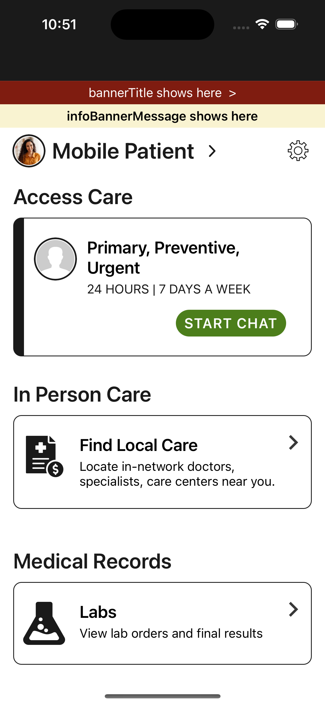
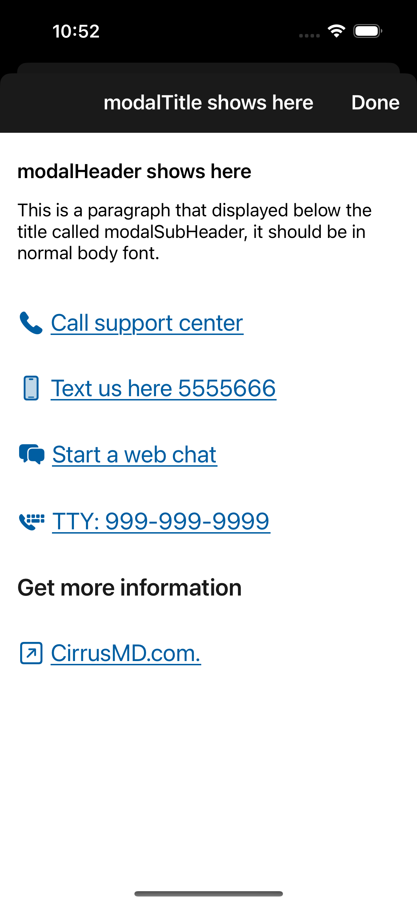

### Pinned Banner
  
The CirrusMDSDK supports the concept of a contact and informational banner that is developer configurable and off by default, that can be shown on some of the main views within the SDK. Specifically this banner is shown on the home screen of the SDK views called the Stream Selector. It is also shown on any chat stream and at the top of the setting page if that page is turned on in the SDK configuration. The two banners can be independently added and will only be shown when their configuration objects are set on the SDK config before the view is constructed. The first banner is the `infoBannerMessage` this is a purely informational banner that can show a line of text at the top of the screen. The `actionModal` banner is tappable and requires you to fill out the action modal object to both give the banner text as well as the modal content before the banner is displayed.

This banner was originally conceived for crisis hotlines to provide patients with contacts or direction when more urgent support is needed. An example of what could use this for is a suicide hotline or domestic violence hotline. Giving patients visibility to other services you offer that might fall outside the services that CirrusMD provides and that you would like to highlight during a patients time of need. Below you will see screen shots showing the design of the banner and the action modal that shows what the code example also provided below will show when configured in this way. Feel free to copy and paste from the code example into your project where you configure the SDK and build and run your app to see how it works and try the different URL options.

          

The code below is an example of how to achieve the above images. You can optionally decide not to add an `infoBannerMessage` and it will not be displayed, or you can decide not to add an `actionModal` and the tappable banner will not be displayed. It is important to note that the banner is added to the screen when it is first constructed so the pinned banner object should be added to the config when the SDK is first initialized to make sure it displays on the home scree.

##### Swift

```swift
let phone = CirrusMDContactOption(icon: .phone, contactText: "Call support center", contactURL: URL(string: "tel:9999999999"))
let text = CirrusMDContactOption(icon: .text, contactText: "Text us here 5555666", contactURL: URL(string: "sms:5555666"))
let chat = CirrusMDContactOption(icon: .chat, contactText: "Start a web chat", contactURL: URL(string: "https://www.currusmd.com/"))
let tty = CirrusMDContactOption(icon: .tty, contactText: "TTY: 999-999-9999", contactURL: URL(string: "tel:9999999999"))
let footerTitle = CirrusMDContactOption(icon: .none, contactText: "Get more information", contactURL: nil)
let footer = CirrusMDContactOption(icon: .link, contactText: "CirrusMD.com.", contactURL: URL(string: "https://www.currusmd.com/"))

let bannerModal = CirrusMDActionModal(bannerTitle: "bannerTitle shows here",
                                      modalTitle: "modalTitle shows here",
                                      modalHeader: "modalHeader shows here",
                                      modalSubHeader: "This is a paragraph that displayed below the title called modalSubHeader, it should be in normal body font.",
                                      contactOptions: [phone, text, chat, tty, footerTitle, footer])

let banner = CirrusMDPinnedBanner(actionModal: bannerModal, infoBannerMessage: "infoBannerMessage shows here")

let config = CirrusMDConfig()
config.pinnedBanner = banner

CirrusMD.singleton.setConfig(config)
```

##### Obective-C

```obj-c
NSString* phoneText = @"Call support center";
NSURL* phoneURL = [[NSURL alloc] initWithString:@"tel:9999999999"];
CirrusMDContactOption* phone = [[CirrusMDContactOption alloc] initWithIcon: CirrusMDContactIconPhone contactText: phoneText contactURL: phoneURL];

NSString* smsText = @"Text us here 5555666";
NSURL* smsURL = [[NSURL alloc] initWithString:@"sms:5555666"];
CirrusMDContactOption* text = [[CirrusMDContactOption alloc] initWithIcon: CirrusMDContactIconText contactText: smsText contactURL: smsURL];

NSString* chatText = @"Start a web chat";
NSURL* chatURL = [[NSURL alloc] initWithString:@"https://www.currusmd.com/"];
CirrusMDContactOption* chat = [[CirrusMDContactOption alloc] initWithIcon: CirrusMDContactIconChat contactText: chatText contactURL: chatURL];

NSString* ttyText = @"TTY: 999-999-9999";
NSURL* ttyURL = [[NSURL alloc] initWithString:@"tel:9999999999"];
CirrusMDContactOption* tty = [[CirrusMDContactOption alloc] initWithIcon: CirrusMDContactIconTty contactText: ttyText contactURL: ttyURL];

NSString* footerTitleText = @"Get more information";
CirrusMDContactOption* footerTitle = [[CirrusMDContactOption alloc] initWithIcon: CirrusMDContactIconNone contactText: footerTitleText contactURL: NULL];

NSString* footerText = @"CirrusMD.com.";
NSURL* footerURL = [[NSURL alloc] initWithString:@"https://www.currusmd.com/"];
CirrusMDContactOption* footer = [[CirrusMDContactOption alloc] initWithIcon: CirrusMDContactIconPhone contactText: footerText contactURL: footerURL];

CirrusMDActionModal* bannerModal = [[CirrusMDActionModal alloc] initWithBannerTitle:@"bannerTitle shows here" modalTitle:@"modalTitle shows here" modalHeader:@"modalHeader shows here" modalSubHeader:@"This is a paragraph that displayed below the title called modalSubHeader, it should be in normal body font." contactOptions:@[phone, text, chat, tty, footerTitle, footer]];

CirrusMDPinnedBanner* banner = [[CirrusMDPinnedBanner alloc] initWithActionModal:bannerModal infoBannerMessage:@"infoBannerMessage shows here"];

CirrusMDConfig* config = [[CirrusMDConfig alloc] init];
config.pinnedBanner = banner;

[CirrusMD.singleton setConfig:config];
```
